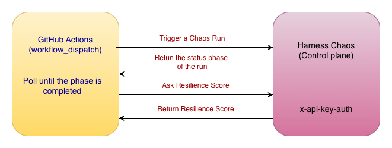
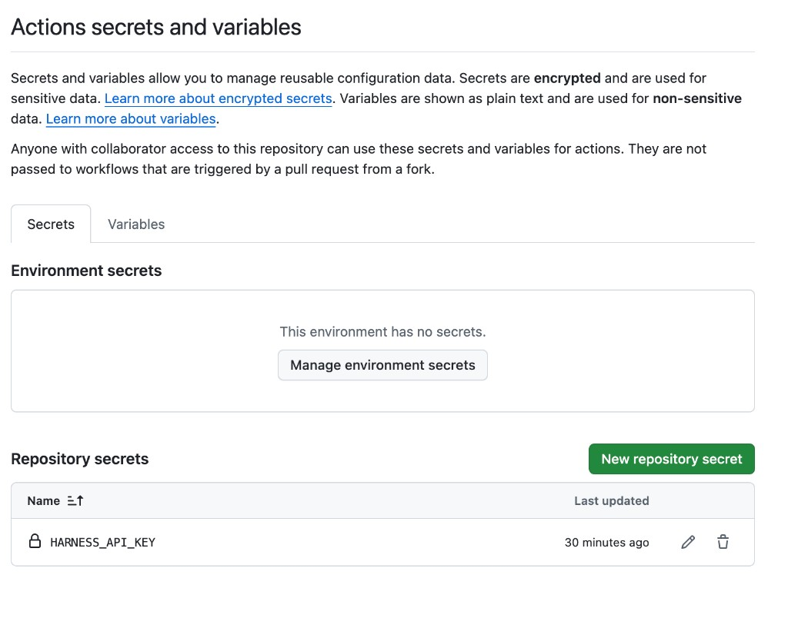
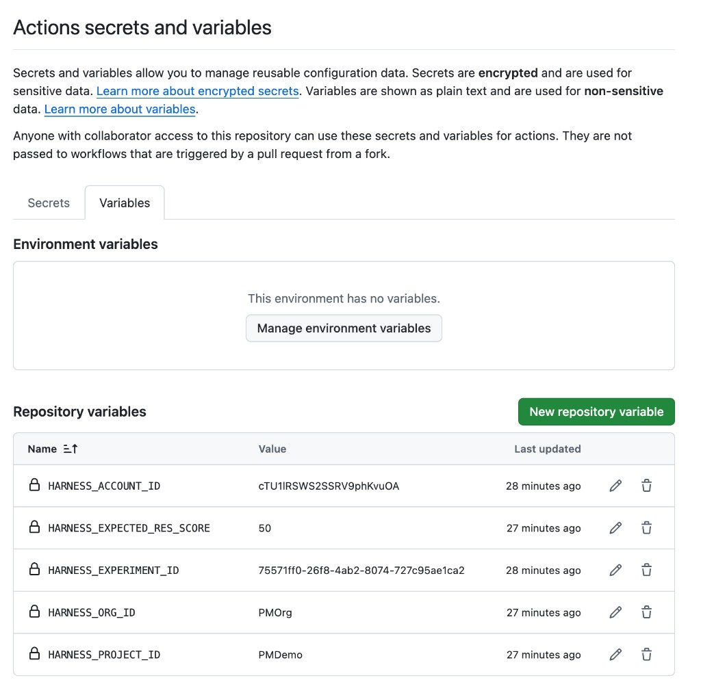
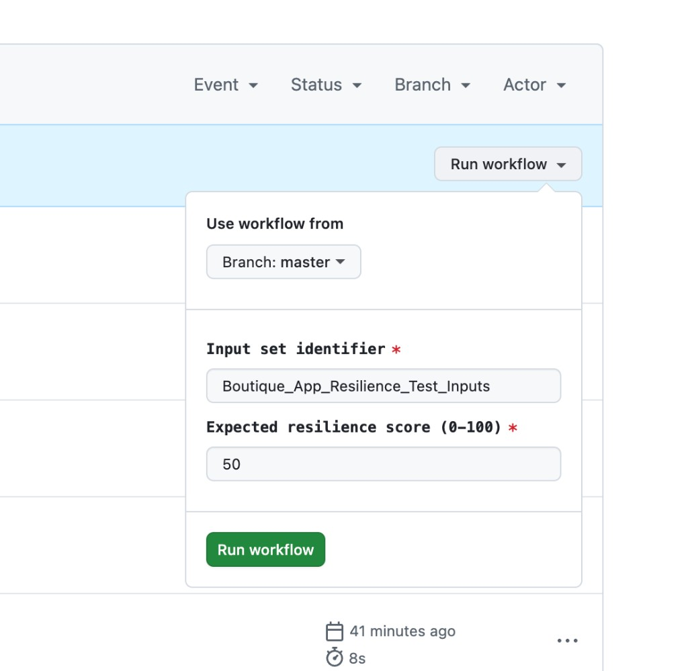
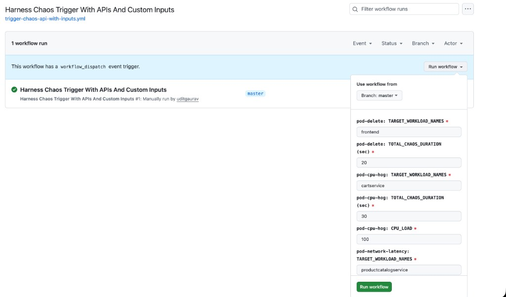

# Harness Chaos Trigger

Trigger, customize, and abort **Harness Chaos Engineering** experiments directly from GitHub Actions — using pure REST APIs (no CLI binary, no Helm chart, no extra runners).

This repository ships three reusable workflows that you can drop into any GitHub repo to wire your application into a Harness chaos experiment as part of CI/CD, on a schedule, or on-demand for game-day exercises.

| Workflow | File | Purpose |
| --- | --- | --- |
| **Harness Chaos Trigger With APIs** | [`trigger-chaos-api.yml`](.github/workflows/trigger-chaos-api.yml) | Run an experiment using a pre-saved **Input Set** — the simplest one-click run. |
| **Harness Chaos Trigger With APIs And Custom Inputs** | [`trigger-chaos-api-with-inputs.yml`](.github/workflows/trigger-chaos-api-with-inputs.yml) | Run an experiment with **runtime overrides** (target workloads, durations, network latency, etc.) entered at trigger time. |
| **Harness Chaos Abort** | [`abort-chaos.yml`](.github/workflows/abort-chaos.yml) | Gracefully or forcefully **stop** a running experiment using its `notifyID`. |

A legacy CLI-based workflow [`trigger-chaos.yml`](.github/workflows/trigger-chaos.yml) is also included for reference, but the three above are the recommended path.

---

## Why use this?

- **Native GitHub experience** — chaos experiments become first-class CI artifacts: triggered from the Actions tab, gated by branch/environment protections, audited via run history.
- **No CLI install** — pure `curl` against the Harness REST API. The runner image just needs `curl` and `jq`, both pre-installed on `ubuntu-latest`.
- **Zero shared state** — the only inputs are repo Secrets/Variables and the run-time form. Easy to fork, easy to demo.
- **Resilience-score gating** — every run automatically validates the actual resilience score against an expected threshold and fails the workflow if the SLO isn't met. Plug it straight into a release gate.
- **One-command abort** — paste a `notifyID` from any prior run to stop chaos immediately if a downstream system is in a bad state.

---

## How it works

<p align="center">
  
</p>

Each workflow:

1. Validates that all required env-vars/secrets are set (fast-fail).
2. Strips whitespace from the API key (defends against pasted newlines).
3. Sends an **auth check** (`GET /variables`) — if the gateway returns an HTML redirect or 401, you get a clear error before the real call.
4. Calls the chaos REST API, captures HTTP status + body, validates JSON before parsing.
5. Polls run state every 2 seconds for up to 10 minutes, tolerating transient gateway errors.
6. On a terminal phase, compares the resilience score to the expected threshold and exits accordingly.

---

## One-time setup

In your GitHub repo: **Settings → Secrets and variables → Actions**.

### 1. Repository secret

| Name | Description |
| --- | --- |
| `HARNESS_API_KEY` | A Harness PAT/SAT scoped to the project, with **Chaos → Execute Experiment** + **View Experiment** permissions. |



### 2. Repository variables

| Name | Example | Description |
| --- | --- | --- |
| `HARNESS_ACCOUNT_ID` | `cTU1lRSWS2SSRV9phKvuOA` | Account identifier (also serves as `routingId`). |
| `HARNESS_ORG_ID` | `PMOrg` | Organization identifier. |
| `HARNESS_PROJECT_ID` | `PMDemo` | Project identifier. |
| `HARNESS_EXPERIMENT_ID` | `75571ff0-26f8-4ab2-8074-727c95ae1ca2` | The chaos experiment workflow UUID. |
| `HARNESS_EXPECTED_RES_SCORE` | `50` | *(Optional, used only by the legacy `trigger-chaos.yml`.)* |



> **Tip:** the API-based workflows take the input-set identifier and expected resilience score from the dispatch form, not from these variables — so you can override per run.

---

## 1. `Harness Chaos Trigger With APIs`

Runs the experiment with a pre-saved Input Set (created in Harness UI). Pick this for the most repeatable, declarative runs.

### Inputs (workflow_dispatch)

| Field | Default | Notes |
| --- | --- | --- |
| **Input set identifier** | `Boutique_App_Resilience_Test_Inputs` | Identifier (not name) of the Input Set to use. |
| **Expected resilience score (0-100)** | `50` | Workflow fails if actual score is below this. |



### Sample run output

```text
ℹ️  Account: cTU1lRSWS2SSRV9phKvuOA  Org: PMOrg  Project: PMDemo  Experiment: 75571ff0-26f8-4ab2-8074-727c95ae1ca2
ℹ️  Auth check (GET /variables): HTTP 200
🚀 experiment ran successfully, notifyID: 56536eba-1d35-478e-bdec-d4cf18ff6833 🎉
The timeout: 600 and delay: 2

Waiting for experiment completion... CurrentState: Queued
Waiting for experiment completion... CurrentState: Running
…
🚀 Experiment completed, CurrentState: Completed_With_Probe_Failure 🎉
The timeout: 600 and delay: 2
🚀 expected Resilience Score: 50, Actual Resilience Score: 75, Actual resilience score meets the expectations 🎉
Resilience score: 75
```

---

## 2. `Harness Chaos Trigger With APIs And Custom Inputs`

Same flow, but every fault parameter is exposed in the dispatch form — useful when you want to vary blast radius, duration, or target workload without editing an input set.

### Inputs (workflow_dispatch)

| Field | Default |
| --- | --- |
| `pod-delete: TARGET_WORKLOAD_NAMES` | `frontend` |
| `pod-delete: TOTAL_CHAOS_DURATION (sec)` | `20` |
| `pod-cpu-hog: TARGET_WORKLOAD_NAMES` | `cartservice` |
| `pod-cpu-hog: TOTAL_CHAOS_DURATION (sec)` | `30` |
| `pod-cpu-hog: CPU_LOAD` | `100` |
| `pod-network-latency: TARGET_WORKLOAD_NAMES` | `productcatalogservice` |
| `pod-network-latency: TOTAL_CHAOS_DURATION (sec)` | `30` |
| `pod-network-latency: NETWORK_LATENCY` | `5000ms` |
| `Expected resilience score (0-100)` | `50` |



The runtime inputs are sent to the API as a `runtimeInputs.tasks` map keyed by the experiment task identifiers — the same shape the Harness UI sends. The defaults match the `Boutique_App_Resilience_Test_Inputs` input set so a default run is functionally equivalent to pipeline 1.

> **Note:** the task keys (`pod-delete-0ef`, `pod-cpu-hog-6zz`, etc.) in this workflow are bound to the **Boutique App Resilience Test** experiment. To target a different experiment, update the keys in the `jq` payload accordingly.

---

## 3. `Harness Chaos Abort`

If a run is misbehaving (or you just need to free the agent), use this workflow to stop it.

### Inputs (workflow_dispatch)

| Field | Default | Notes |
| --- | --- | --- |
| **Notify ID** | *(required)* | The `notifyID` printed by the trigger workflows. |
| **Force stop** | `false` | Set `true` to terminate immediately instead of graceful shutdown. |

### Sample run output

```text
ℹ️  Account: cTU1lRSWS2SSRV9phKvuOA  Org: PMOrg  Project: PMDemo  Experiment: 75571ff0-26f8-4ab2-8074-727c95ae1ca2
ℹ️  notifyID: 56536eba-1d35-478e-bdec-d4cf18ff6833  force: false
🛑 Experiment aborted successfully 🎉
experimentName: boutique-app-resilience-test
experimentId:   75571ff0-26f8-4ab2-8074-727c95ae1ca2
notifyID:       56536eba-1d35-478e-bdec-d4cf18ff6833
```

---

## REST APIs used

All calls hit `https://app.harness.io/gateway/chaos/manager/api` with `x-api-key: <HARNESS_API_KEY>`:

| Operation | Method | Path |
| --- | --- | --- |
| Auth check / fetch runtime variables | `GET` | `/rest/v2/experiments/{experimentId}/variables` |
| Run experiment | `POST` | `/rest/v2/experiments/{experimentId}/run` |
| Poll run status | `GET` | `/rest/v2/experiments/{experimentId}/run?notifyId={id}` |
| Stop experiment run | `POST` | `/rest/v2/experiment/{experimentId}/stop?notifyId={id}&force={bool}` |

Common query parameters: `accountIdentifier`, `organizationIdentifier`, `projectIdentifier`, `routingId` (= account id), `isIdentity=false` (for the run/poll endpoints, since we pass the workflow UUID).

---

## Customizing for your own experiment

1. In Harness UI, open the experiment you want to automate and copy the workflow UUID into `HARNESS_EXPERIMENT_ID`.
2. *(Optional)* create an Input Set in the Harness UI and use its identifier in the **Input set identifier** field of pipeline 1.
3. To rebuild pipeline 2 for a different experiment, replace the task keys in the `jq` payload with the keys from your experiment's runtime variables. You can fetch them via `GET /rest/v2/experiments/{id}/variables`.

---

## Troubleshooting

| Symptom | Likely cause | Fix |
| --- | --- | --- |
| `Auth check failed … HTTP 401` and an HTML "Harness Redirect" body | The API key isn't reaching the gateway, or it lacks RBAC. | Re-create the secret without trailing whitespace. Confirm the PAT has Chaos *Execute* + *View* on the project. |
| `Failed to trigger experiment (HTTP 400)` with `experiment not found` | Wrong `HARNESS_EXPERIMENT_ID` or `isIdentity` mismatch. | Use the workflow UUID; the workflow already passes `isIdentity=false`. |
| Workflow times out at 10 min | Experiment legitimately runs longer than 600s. | Increase `TIMEOUT` env var in the workflow YAML. |
| `Resilience score below threshold` failure | Actual score < expected. | Either tune the experiment, fix the regression, or lower the expected score. |
| `transient poll error (HTTP 502)` lines but the run still completes | Brief gateway hiccup. | Ignored automatically — the loop continues polling. |

---

## License

Internal demo / customer-enablement asset. Reuse and adapt freely within Harness customer accounts.
